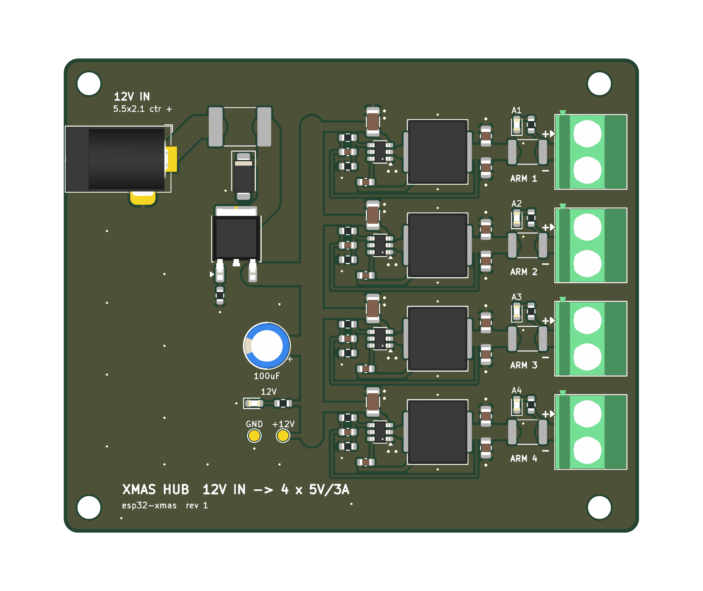
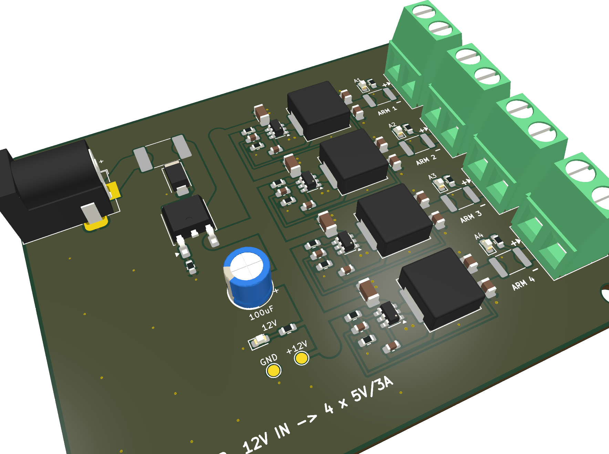

# xmas_hub — 12 V to 4 × 5 V star power hub

Second board in this repo. One of these sits at the base of the tree; a 12 V
barrel supply goes in, four independently regulated and fused 5 V "arms" come
out on screw terminals, and each arm feeds a short cluster of 3–4 `xmas_orn`
ornaments through their DC‑002 (3.5 × 1.3 mm) barrel jacks.



## Why per-arm regulators

Distributing 12 V and converting near the load is what makes the star
topology work at hobby wire gauges: the trunk carries a quarter of the current
it would at 5 V, and every arm is its own 5 V domain. A short or overload on
one arm drops that arm's PTC / that buck's hiccup limit, and the other three
keep running. "Isolated" here means independently regulated and fused, not
galvanically isolated — all arms share ground.



## Circuit

| Block | Parts | Notes |
|---|---|---|
| Input | J1 DC‑005 5.5 × 2.1 mm, centre + | Flush with the left board edge. Project footprint in `xmas_hub.pretty`: the DC‑005 has its **sleeve** on the lateral pin and the **switch** in line with the centre pin, the opposite of KiCad's generic `BarrelJack_Horizontal`, which would have put GND on the contact that opens when a plug goes in. |
| Input protection | F1 5 A PTC (2920), D1 SMAJ15A TVS, Q1 AOD417 P‑FET + R1 100k | Q1 sits in the high side with its body diode toward the load: ~30 mV drop at 3 A instead of a Schottky's 0.5 V. On a reversed supply Q1 blocks and D1 conducts forward so F1 trips. |
| Bulk | C1 100 µF 25 V radial, 6.3 mm / 2.5 mm pitch | On the +12V bus |
| Indicator | D2 red + R2 2.2k | 12 V present |
| Arm ×4 | U TPS54302, L 10 µH (Sunlord MWSA0804S‑100MT), Cin 10 µF, Cboot 100 nF, Cout 2 × 22 µF, R 100k / 13.7k, Cff 75 pF | TI's 5 V / 3 A reference circuit from the datasheet (SLVSDG6), with the bottom divider resistor changed from 13.3k to the stocked 13.7k: Vout = 0.596 V × (1 + 100/13.7) = 4.95 V. That is inside USB tolerance and leaves ~1 V of headroom over the ornament's Schottky + 3.3 V LDO even after cable drop. EN is left floating: the part has an internal pull‑up and its own VIN UVLO. |
| Arm output | F 2.6 A PTC (1812), green LED + 1k, 5.08 mm screw terminal | Pin 1 (marked `+`) is +5 V, pin 2 is GND |
| Test points | TP1 +12V, TP2 GND | |

Budget: an ornament is ~0.4 A typical (ESP32‑S3 plus backlight, more with
Wi‑Fi). Twelve of them is ~25 W, so a **12 V / 3 A adapter** is the sensible
supply; each arm can deliver up to 3 A but the input PTC and the adapter cap
the total. The board is designed for 12 V only: Q1's Vgs rating and D1's 15 V
standoff both assume it.

## Layout

80 × 66 mm, two layers, 1 oz. Ground pours on both sides, stitched under each
buck. Switch nodes are short and wide; the feedback sense runs back along the
bottom of each row from the output capacitors, away from the inductor. M3 holes
in the corners.

Copper widths were sized with IPC‑2221 for 1 oz outer copper at a 10 °C rise
(0.5 mm ≈ 1.45 A, 1.2 mm ≈ 2.7 A, 2 mm ≈ 4 A, 3 mm ≈ 5.3 A; a 0.4 mm‑drill via
≈ 1.1 A):

| Net | Current | Copper |
|---|---|---|
| Jack → F1 → D1 → Q1 → bus | up to the 5 A PTC | 3.0 mm |
| +12V bus | total input, ≤5 A | 3.0 mm |
| Per‑arm 12 V feed into Cin | ~1.4 A avg at 3 A out | 1.2 mm, 0.6 mm stub into the VIN pin |
| SW node | 3 A pulsed | 1.5 mm, 0.7 mm at the SOT‑23 pin |
| 5V out (L → Cout → PTC) and ARM (PTC → terminal) | 3 A | 2.0 mm |
| IC GND pin (low‑side return, ~1.8 A avg) | | 0.6 mm to two 0.8/0.4 mm vias |
| Cin GND | ~1.5 A ripple | 0.8 mm to two 0.8/0.4 mm vias |
| Cout GND | ripple | 0.8 mm to one 0.8/0.4 mm via each |
| Terminal and jack GND pins | 3 A / 5 A | through‑hole into both planes |
| FB sense, boot, LEDs, test points | signal | 0.25–0.5 mm |

## Arm cables

Each arm is a twin‑lead harness with a 3.5 × 1.3 mm barrel plug (centre
positive) at each ornament. Use 20–22 AWG for the run from the hub to the
cluster and keep the runs short — that is the point of the star. The
ornament's J2 jack is DNP by default; populate it on ornaments that will be
fed from the hub.

## Enclosure

[`enclosure/`](enclosure/) holds a printed two-part box: base with standoffs, lid with
screw bosses, four M3 x 16 screws from underneath doing double duty as board and lid
fixings. Notch for the 12 V jack on the left, four wire windows for the arm terminals on
the right, LED sight holes and vents in the lid. STLs are print-oriented for the A1 mini.
See [enclosure/README.md](enclosure/README.md).

## Documents

`docs/` has the rev 1 schematic and the top and bottom layer plots as PDFs,
same naming as the ornament board, plus PNG renders: the
[schematic](docs/xmas_hub_rev1_schematic.png), and
[top](docs/xmas_hub_rev1_top.png), [bottom](docs/xmas_hub_rev1_bottom.png) and
[angled](docs/xmas_hub_rev1_iso.png) 3D views of the board. `docs/datasheets/` holds the datasheets the
design was checked against: TPS54302, AOD417, SMAJ15A, both PTCs, the DC‑005
jack (whose drawing is where the pin mapping above comes from), the KF301
terminal, the electrolytic and the Sunlord MWSA inductor series.

## Ordering (JLCPCB)

`production/` holds gerbers + drills (`JLCPCB_xmas_hub.zip`), a position file
and a BOM. Every line is sourced on LCSC; the `LCSC Part #` field is on each
symbol and footprint, so the Fabrication Toolkit picks it up too.

| Part | Value | MPN | LCSC |
|---|---|---|---|
| U1–U4 | buck | TPS54302DDCR | C311983 |
| L1–L4 | 10 µH | Sunlord MWSA0804S‑100MT | C17700171 |
| Q1 | P‑FET | AOD417 | C131415 |
| D1 | TVS | SMAJ15A (Littelfuse) | C148216 |
| F1 | 5 A PTC | 2920L500/16MR | C207091 |
| F11–F41 | 2.6 A PTC | SMD1812P260TF/16 | C438899 |
| J1 | barrel | DC‑005 (2.0 mm pin) | C16214 |
| J2–J5 | terminal | KF301‑5.0‑2P | C474881 |
| C1 | 100 µF 25 V | Chengx GR107V025E11RR0VH4FP0 | C44601 |
| C11–C41 | 10 µF 25 V X7R 1206 | CL31B106KAHNNNE | C14860 |
| C12–C42 | 100 nF 50 V X7R 0603 | CL10B104KB8NNNC | C1591 |
| C13/C14 … | 22 µF 10 V X5R 0805 | CL21A226MPQNNNE | C29277 |
| C15–C45 | 75 pF C0G 0603 | CC0603JRNPO9BN750 | C282074 |
| R1, R11–R41 | 100k | 0603WAF1003T5E | C25803 |
| R12–R42 | 13.7k | RC0603FR‑0713K7L | C482771 |
| R13–R43 | 1k | 0603WAF1001T5E | C21190 |
| R2 | 2.2k | 0603WAF2201T5E | C4190 |
| D2 | red 0603 | KT‑0603R | C2286 |
| D11–D41 | green 0603 | KT‑0603G | C12624 |

The KF301 is 5.0 mm pitch on a 5.08 mm footprint; 0.08 mm over two pins is
nothing. Codes were checked against LCSC/JLCPCB listings on 2026‑09‑06; stock
moves, so let JLC substitute equivalents for the passives if one is out.

## Regenerating

The schematic and PCB were bootstrapped by the scripts in `scripts/`:

```powershell
python3 scripts/gen_sch.py                      # -> xmas_hub.kicad_sch
kicad-cli sch export netlist --format kicadxml -o scripts/hub.xml xmas_hub.kicad_sch
<kicad python> scripts/gen_pcb.py               # -> xmas_hub.kicad_pcb
```

`<kicad python>` is the interpreter inside the KiCad app bundle (it has the
`pcbnew` module). The scripts are one‑shot generators: they **overwrite** the
files, so once the design is edited in KiCad, leave them alone or treat them as
a record of how it was laid out. ERC and DRC (with schematic parity) pass with
`kicad-cli`; the only reports left are "library not configured" notes from
running headless.
