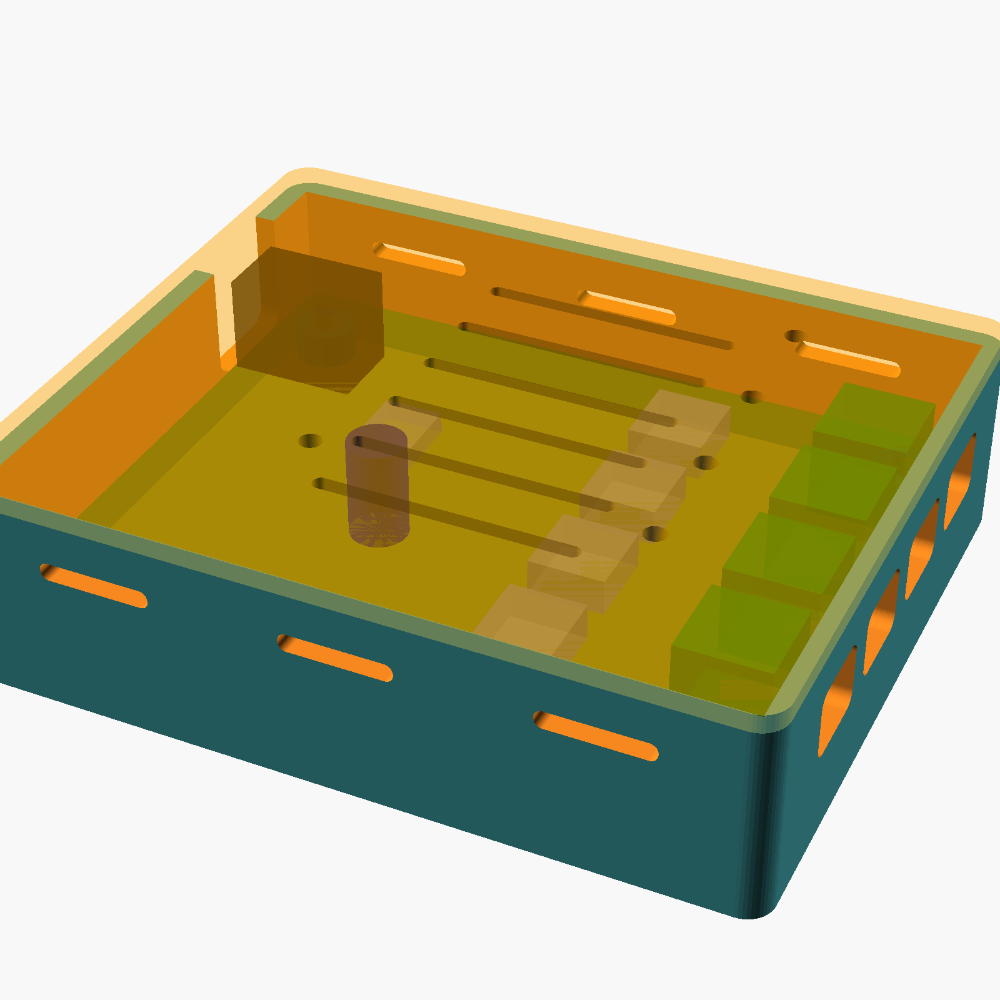
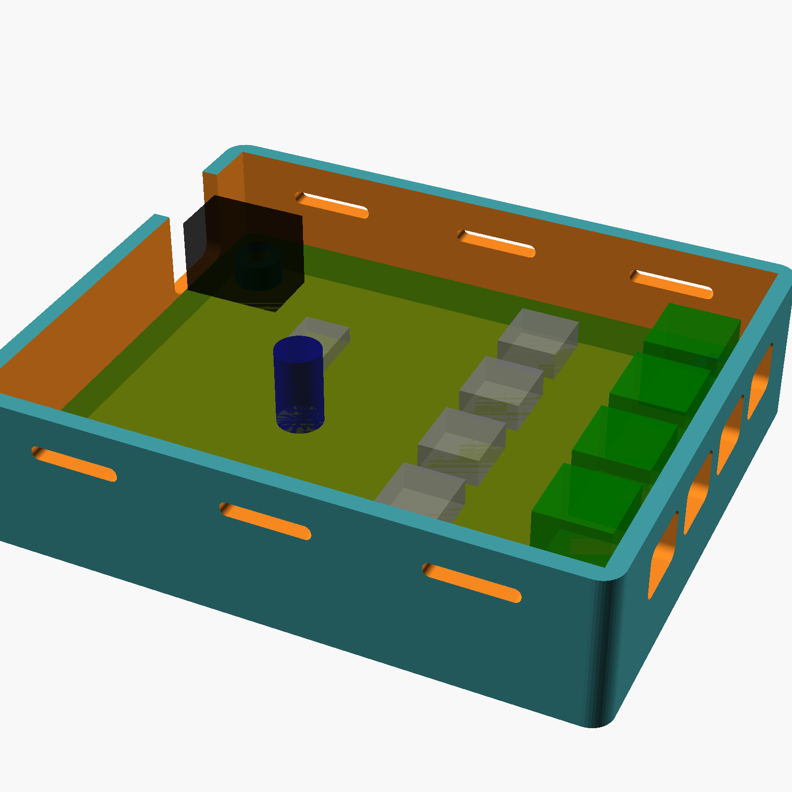

# xmas_hub enclosure

A plain two-part box for the power hub. Same toolchain as the ornament case: parametric
OpenSCAD in [`xmas_hub_case.scad`](xmas_hub_case.scad), print-oriented STLs in [`stl/`](stl/)
from `export.sh`, sized for the Bambu Lab A1 mini.

The board's own four M3 corner holes are used as-is; no board change was needed.

## Parts

| Part | File | Print | Size |
|------|------|-------|------|
| Base | `stl/xmas_hub_base.stl` | floor down, no supports | 85.8 x 71.8 x 21.8 mm |
| Lid | `stl/xmas_hub_lid.stl` | top face down (bosses up), no supports | 85.8 x 71.8 x 15 mm |

Hardware: 4 x **M3 x 16** screws. PLA is fine for both parts.

## How it goes together

The four screws go in from underneath. Each passes through a counterbore in the floor, the
standoff, the board's mounting hole, and bites into a boss hanging from the lid. One screw
per corner therefore clamps the board *and* holds the lid; the top face is plain apart from
the vent slots and five LED sight holes. Assembly order: drop the board onto the standoffs,
wire the terminals, fit the lid, flip the box over, screws in.

The bosses have 2.5 mm pilots for self-tapping M3. Set `boss_hole = 4.0` for M3 heat-set
inserts.

## Openings

- **12 V in, left wall**: a 13.5 mm wide notch, open to the top, centred on the DC-005 jack.
  The jack's barrel axis is 6.5 mm above the board and a 5.5 mm plug's overmould can be
  11 mm across, so the notch reaches the lid rather than leaving a thin bar above the plug.
  The lid's alignment lip is cut away over the notch for the same reason.
- **Arm outputs, right wall**: four 9.8 x 7.5 mm windows on the KF301 wire entries, 3.2 mm
  bars between them. Wires go in through the window; the terminal screws are on top of the
  blocks and are reached with the lid off.
- **LED sight holes in the lid**: 2.5 mm, over D2 (12 V present) and the four green arm LEDs.
- **Vents**: six slots in the lid over the regulators and three per long wall. The hub
  dissipates a couple of watts at full load. `vent = false` removes them.

## Stack

| z (mm) | |
|-------:|--|
| -3.2 | floor bottom, 6.5 x 2.2 mm counterbores for the screw heads |
| 0 | floor top |
| 4.0 | board bottom on the standoffs (through-hole pins underneath need ~3 mm) |
| 5.6 | board top; lid bosses land here |
| 16.6 | top of C1, the 100 uF radial, the tallest part (11 mm) |
| 18.6 | wall top / lid underside |
| 20.6 | lid top |

Board to wall clearance 0.5 mm; lid lip to wall 0.25 mm.

`part = "check_base_boards"`, `"check_lid_boards"` and `"check_lid_base"` render the
intersections with mock parts (board, jack, terminals, C1, inductors, Q1); all three are empty.
Terminal positions are taken from the footprints' F.Fab outlines, not their origins, since the
MKDS footprint's origin is pin 1 rather than the body centre.
