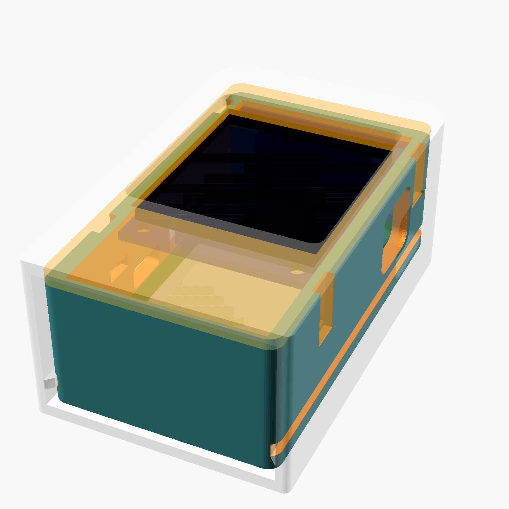
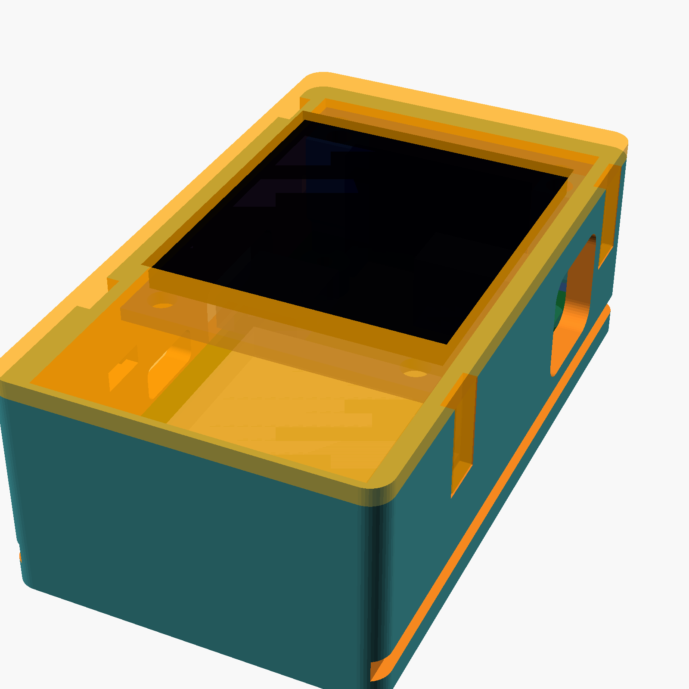
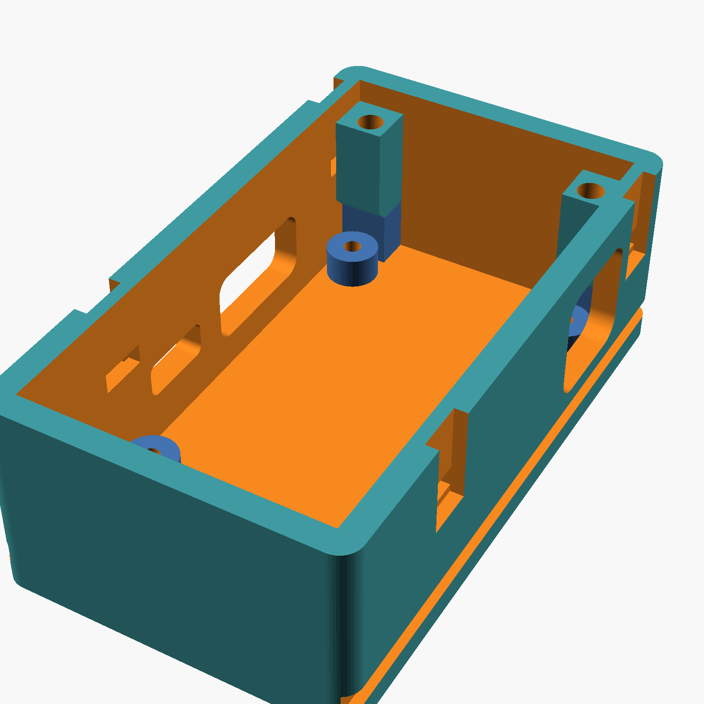
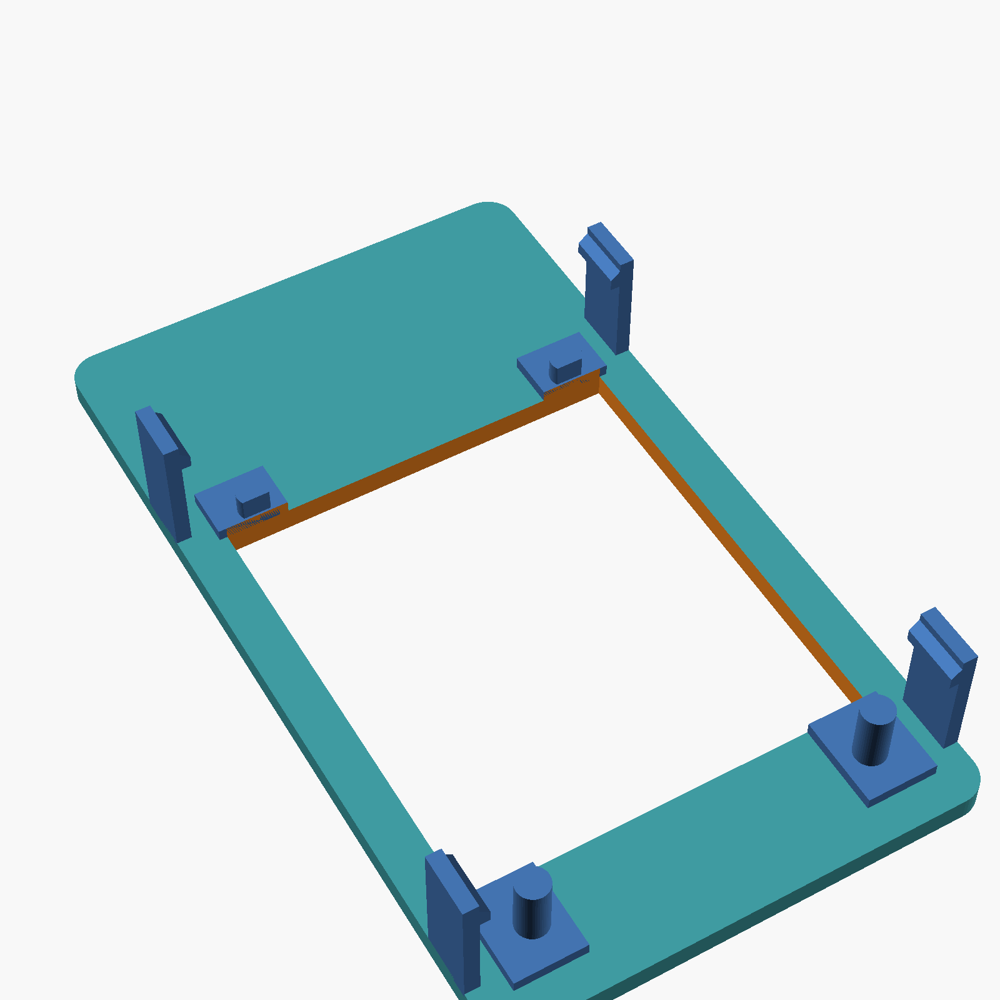
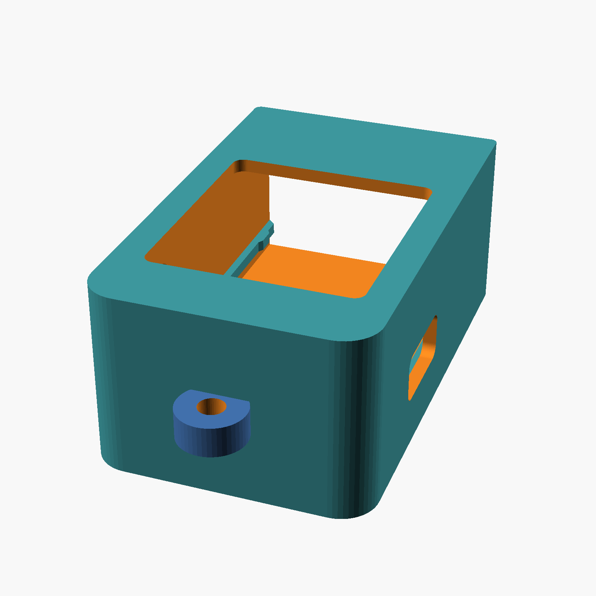

# xmas_orn enclosure: common core + swappable outers

Printed on a **Bambu Lab A1 mini** (180 mm cube, 0.4 mm nozzle). Source of truth is
[`xmas_orn_case.scad`](xmas_orn_case.scad) (OpenSCAD, parametric); `export.sh` writes the
print-oriented STLs into [`stl/`](stl/). Open the STLs in Bambu Studio as-is.

The idea is the Happy Meal handheld: one **core** that holds the electronics, and any number
of **outers** that the same core slots into. The core is the part that has to be right; an
outer only has to match the core's envelope.



## Parts

| Part | File | Print | Notes |
|------|------|-------|-------|
| Core tray | `stl/xmas_orn_tray.stl` | floor down, no supports | Holds the rev 2 board on four M2 posts, the display above it on its J1 socket |
| Core bezel | `stl/xmas_orn_bezel.stl` | face down (hooks up), no supports | Snaps onto the tray, frames the glass, pegs locate the display |
| Default outer: sleeve | `stl/xmas_orn_sleeve.stl` | standing on its open end, brim | Rounded hanging tag; the core slides in from the bottom |

Material: PETG for the bezel (the snap hooks flex 0.65 mm; PLA works but will fatigue after
a few dozen cycles). PLA is fine for the tray and outers.

Hardware: 4 x M2 x 6 mm screws, self-tapping into the 1.7 mm pilots in the tray posts.
Set `post_hole = 3.2` for M2 heat-set inserts instead.

## Core

 

Stack, from the tray floor up:

| z (mm) | What |
|-------:|------|
| 0 | tray floor top (floor is 1.6 thick) |
| 3.0 | PCB bottom on the posts. Clears the J1 and USB-C legs. |
| 4.6 | PCB top |
| 13.1 | top of J1 (8.5 mm socket) |
| 15.6 | display PCB rear: header body 2.5 sits on the socket |
| 16.8 | display PCB front, bezel pads bear here |
| 18.5 | glass front |
| 17.6 | tray wall top / bezel plate underside |
| 19.2 | bezel top (core height 20.8 incl. floor) |

The display's pin row is 4.89 mm from its top edge and J1 is 1.49 mm from the board's, so the
display overhangs the board's header edge by 3.4 mm. The tray's top wall carries two bosses in
that overhang; the bezel's top pegs go through the display's top mounting holes into them.
The bottom pegs are D-shaped locators only (those holes sit over the ornament board).

Openings in the tray walls (all in board coordinates: x from the left edge, y from the antenna
edge):

- **DC jack, right wall**: 11 x 10.4 window centred on J2 (y = 32.65), z 4.2 .. 14.6 above the
  floor. Takes a 3.5 mm plug with an overmould up to 10 mm across. Nothing sits in front of it.
- **USB-C, left wall**: 13 x 6.6 window centred on J3 (y = 26.7).
- **LED glow slot, left wall**: over D1/D2 (`led_window = false` to remove).
- **Antenna pocket**: the cavity runs 6.8 mm past the board's bottom edge so the WROOM-1's
  antenna overhang is in free air. Nothing metallic goes there.

BOOT and RST are under the display and are not reachable with the core assembled; the board
enumerates over USB for flashing anyway.

Assembly: screw the board into the tray (USB-C toward the LED slot). Plug the display onto J1.
Press the bezel on until all four hooks click into the wall slots. To open, lift the two hooks
on one side with a fingernail.



## Outer interface

What an outer needs to know, all defined once in the `OUTER INTERFACE` block of the `.scad`:

| | |
|---|---|
| Envelope | 32.8 (x) x 56.75 (y) x 20.8 (z) mm, 2 mm corner radius on the long edges |
| Grooves | one per long side, 2.0 wide x 1.0 deep, 0.6 .. 2.6 above the floor top, full length and open at both ends |
| Detent notch | in each groove, 0.5 deeper, at y -6.5 .. -2.9 (antenna end) |
| Front | the bezel window (glass + 0.4) is the only thing that needs to show; the bezel's rim can be covered |
| Sides | the jack and USB windows above; an outer either exposes them or accepts that the core must come out to plug in |

The `env_*`, `groove_*`, `notch_*`, `usb_win`, `jack_win` and `glass_*` variables give the
numbers, so an outer written in the same file (or one that `include`s it) never restates them.

## Default outer: sleeve



A rounded tag, 37 x 25 x 60 mm plus a 9 mm hanging loop with a 3.5 mm hole (front-to-back,
so the ornament faces out). 1.8 mm walls, 0.3 mm clearance to the core. The core slides in
from the bottom on two rails that ride the grooves; 0.45 mm bumps on the rails drop into the
core's notches at the end of travel. Once a plug is in the jack (or USB) the core cannot slide
out at all, since the plug passes through the sleeve wall.

The front window is the glass plus 1.2 mm, so what shows is the bezel's inner rim; the sleeve's
lip covers the bezel's outer rim and keeps the bezel on.

Print standing on the open end. The closed end bridges 21 mm across the inside, which the A1
mini does without support. Use a brim: the footprint is small for a 67 mm tall part.

## Things to measure before trusting the numbers

Everything above came from the KiCad board and the display vendor drawing, not from parts in
hand. The parameters most likely to need a nudge:

- `disp_gap` (11.0): socket height plus the display header body. If the display sits higher or
  lower the bezel pads and pegs are the first thing to bind; the hook slots have 0.4 mm slack.
- `glass_top_off` (6.2): where the glass starts below the display's top edge. The vendor drawing
  does not dimension it; it is inferred from the pin row and the 29.22 mm glass length. If the
  window is off, change this one number.
- `jack_win`: sized from the DC-002 3D model in the project (body 11.3 x 5.0 x 7.3, barrel axis
  4.6 above the board). Generous on purpose.
- `disp_hole_d` (2.5): the display's mounting hole size, undimensioned in the drawing.

`part = "check_*"` renders the intersections used to verify the design: tray vs boards, bezel
vs boards, bezel vs tray, sleeve vs core, and sleeve vs core pushed 8 mm out (only the detent
bumps should overlap). All are empty except the last.

## Rendering

```sh
./export.sh                       # all three STLs, print orientation
openscad -D 'part="assembly"' xmas_orn_case.scad     # everything, with mock boards
```

OpenSCAD 2026.09 snapshot from `brew install --cask openscad@snapshot`; the stable cask is
currently disabled on macOS.
