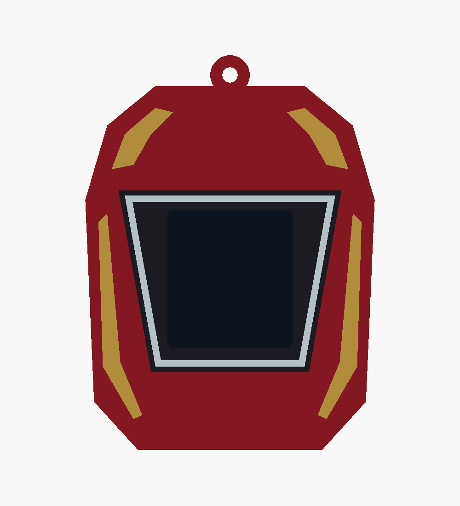

# Iron Man v2b — fresh iteration from v2

Starts directly from the original v2 Iron Man sleeve. Its outline, dimensions, hanging loop,
core pocket, rails, detents and openings are unchanged. Only the front colour layout is
replaced: red chest armour, small angular gold panels, and a white trapezoid reactor frame
around the display. No source or geometry is imported from the archived attempts.

- [Editable source](ironman_v2b.scad), directly including [v2](xmas_orn_outers_v2.scad)
- [Four printable STLs](stl/ironman_v2b/)
- [Angled preview](docs/ironman_v2b_iso.png)
- [Validation results](docs/ironman_v2b_validation.json)
- [Archived v3–v10 attempts](failures/README.md)

Overall size including hanging loop: **66 × 25 × 90 mm**, matching v2. Original v1 and v2
files remain in place. All post-v2 attempts preceding this reset, including their sources,
scripts, STLs, previews, instructions and validation reports, are in `failures/`.

Load all four STLs together as **one object with multiple parts** in Bambu Studio. Assign
red PLA to `body`, gold/yellow to `gold`, black to `black`, and white to `white`. Keep the
shared coordinates and print on the open bottom with a brim, using the existing v2 settings.
The 0.8 mm inlays retain 1.0 mm of body backing. The dark preview screen is not exported.

Run `./export_ironman_v2b.sh` to rebuild. OpenSCAD selections include `ironman_v2b`, individual
parts such as `gold_print`, and `check_core`, `check_colours`, `check_backing`, `check_baseline`.
All four meshes are watertight, the body is connected, and core clearance and backing checks
are empty. The symmetric difference against the complete v2 sleeve is empty: only colour
partitioning changed. Colour intersections are below 0.0001 mm³. Physical fit and slicing
remain untested.
