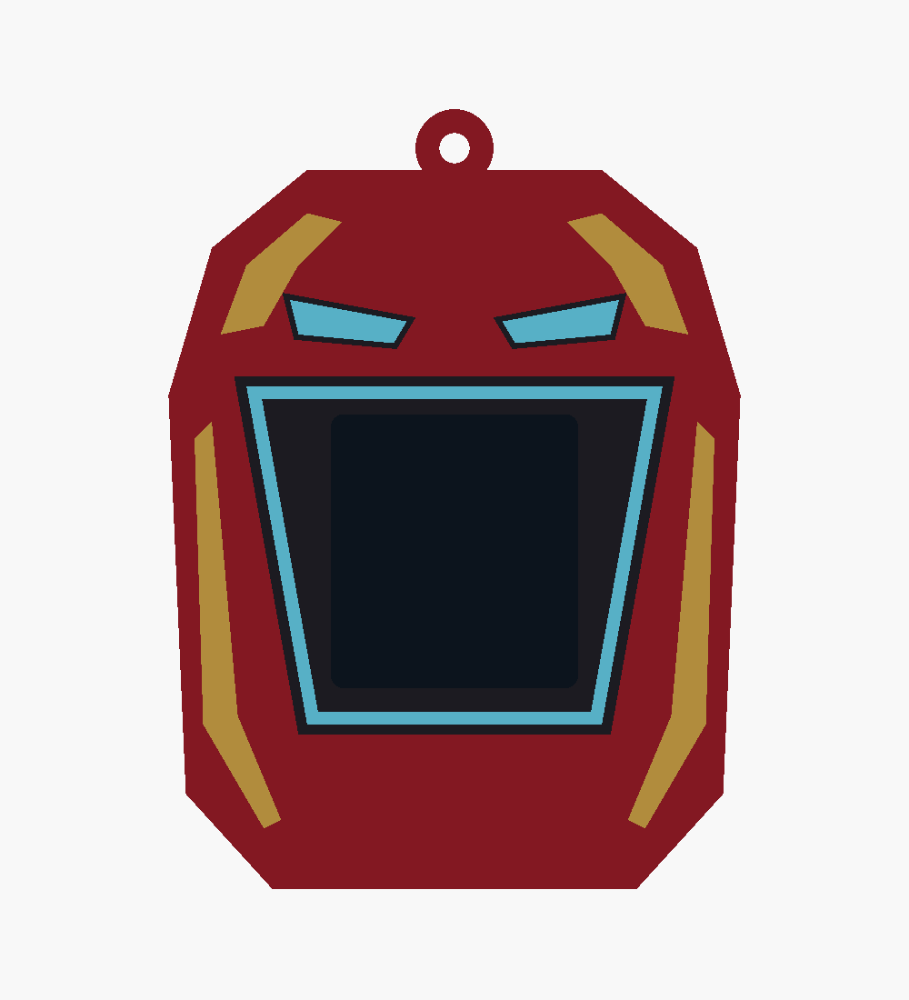

# Iron Man v2c — blue eyes and reactor

Adds narrow blue eye lenses above the display to v2b, with the same blue on the trapezoid
reactor frame. The red/gold design, sleeve shape and core fit stay the same. V2b and all
earlier versions are preserved.

- [Editable source](ironman_v2c.scad)
- [Four printable STLs](stl/ironman_v2c/)
- [Angled preview](docs/ironman_v2c_iso.png)
- [Validation results](docs/ironman_v2c_validation.json)

Load the four STLs together as **one object with multiple parts** in Bambu Studio. Assign
red PLA to `body`, gold/yellow to `gold`, black to `black`, and pale cyan/light blue to `cyan`.
The eyes and reactor share the cyan part, keeping the total to four filaments. These colour
inlays represent the blue glow; this revision does not add lighting hardware.

Keep the shared part coordinates and print on the open bottom with a brim, using the
existing v2 settings. Size remains **66 × 25 × 90 mm**, with 0.8 mm inlays and 1.0 mm of
body backing. The dark display proxy appears only in previews.

Rebuild with `./export_ironman_v2c.sh`. Selections include `ironman_v2c`, individual parts
such as `cyan_print`, and `check_core`, `check_colours`, `check_backing`, `check_baseline`.
All four meshes are watertight; the body is connected. Core clearance, backing and the
geometry comparison against v2 are empty. Colour intersections are below 0.0001 mm³.
Physical fit and slicing remain untested.
