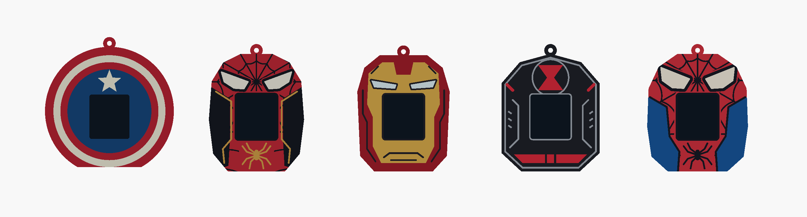
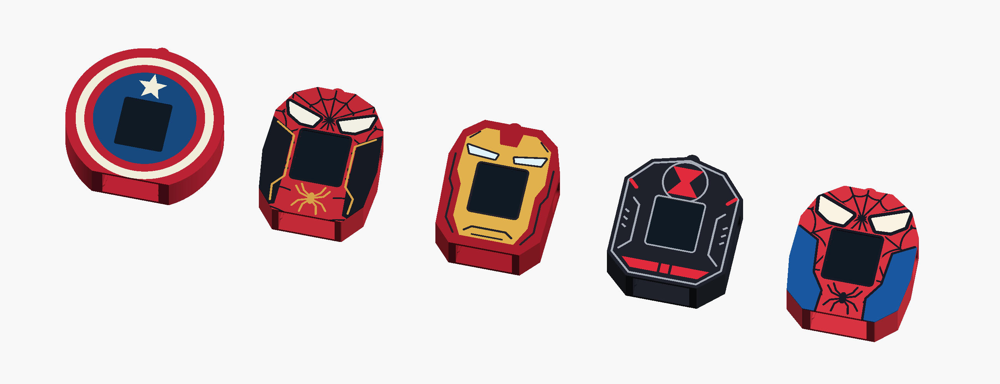

# Superhero outers — version 2

Five redesigned sleeves for the existing ornament core. The character features sit above
the display so the opening no longer cuts through the eyes or main emblem. The original
`xmas_orn_outers.scad`, `export_outers.sh`, `stl/outers/` and their previews are preserved.



| Theme | Design | Filament parts | Width × depth × height, including loop |
|---|---|---|---|
| `cap` | Shield rings with an intact star above the screen | `body`: red; `white`; `blue` | 92 × 25 × 93 mm |
| `spidey_nwh` | Angular mask lenses, scalloped webs, black suit panels and a gold spider | `body`: red; `black`; `gold`; `white` | 68 × 25 × 91 mm |
| `ironman` | Gold helmet faceplate, narrow light eyes, cheek seams and jaw vents | `body`: red; `gold`; `black`; `white` | 66 × 25 × 90 mm |
| `widow` | Angular black badge, complete red hourglass, silver border and belt detail | `body`: black; `silver`; `red` | 70 × 25 × 91 mm |
| `spidey_classic` | Broad white lenses, scalloped webs, blue suit panels and a black spider | `body`: red; `blue`; `black`; `white` | 72 × 25 × 91 mm |

The plain dark rectangles in the previews represent the display, and are excluded from
every printable part. Set `preview_display = false` to inspect the open window.



## Files and printing

- Editable source: [`xmas_orn_outers_v2.scad`](xmas_orn_outers_v2.scad).
- All 18 printable colour parts: [`stl/outers_v2/`](stl/outers_v2/), grouped by theme.
- Rebuild the STLs and both previews: `./export_outers_v2.sh`.
- In OpenSCAD, select `part = "cap"` (or another theme) for an assembled colour view;
  `part = "showcase_v2"` shows the entire set. A selection such as
  `part = "ironman_gold_print"` exports just that filament in the shared print orientation.

Load **all STLs for one theme together** into Bambu Studio as a single object with multiple
parts. Assign the filaments from the table. Keep their relative coordinates: individual
inlays are not intended to be placed independently on the bed or printed separately.
Each design uses three or four filaments, within the AMS lite's four slots.

The exports stand on their flat bottom with the core entry facing the bed. Use PLA,
a brim, a 0.4 mm nozzle and a 0.16–0.20 mm layer height. The 0.8 mm inlays are flush with
the front and retain 1.0 mm of body behind them. Silver-coloured PLA can be replaced by
light grey or white PLA; gold can be replaced by yellow PLA.

Colour parts share the same height layers, so multicolour printing requires filament swaps
within layers. Check the slicer's purge and time estimates. The closed pocket end retains
the original sleeve's approximately 21 mm bridge; inspect the sliced bridge paths before
printing. These parts fit within the A1 mini's 180 mm build volume.

## Fit and validation

The source includes `xmas_orn_case.scad` directly. It reuses the existing pocket clearance,
rails, detents, hanging loop, display opening, USB/DC tunnels and finger recesses. The core
still slides in from the bottom. No electronics or core design changes are required.

[`docs/outers_v2_validation.json`](docs/outers_v2_validation.json) records the checked STL
hashes, source hashes, dimensions and geometry results. All 18 meshes are watertight with
consistent winding, all five bodies are single connected solids, and all five seated-core
intersection checks are empty. Colour overlap and inlay backing checks pass at a
0.0001 mm³ tolerance for numerical boundary fragments.

To repeat after editing, export first and then run:

```sh
python3 -m venv /tmp/outers-v2-validation
/tmp/outers-v2-validation/bin/pip install trimesh numpy networkx
/tmp/outers-v2-validation/bin/python validate_outers_v2.py
```

These are CAD and mesh checks; physical fit and slicing have not been tested. The core's
existing measurement assumptions in the [enclosure README](README.md) still apply.
