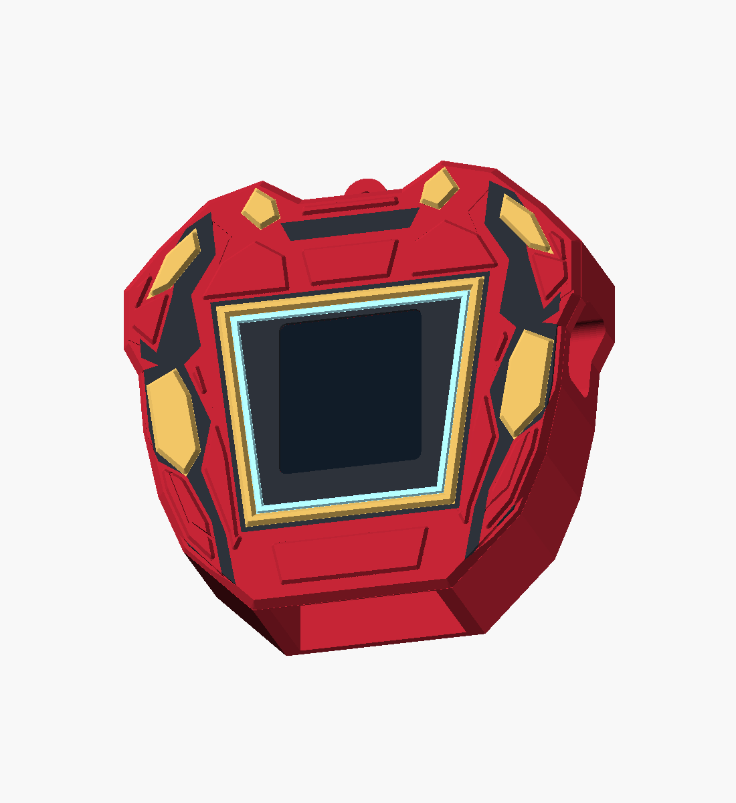
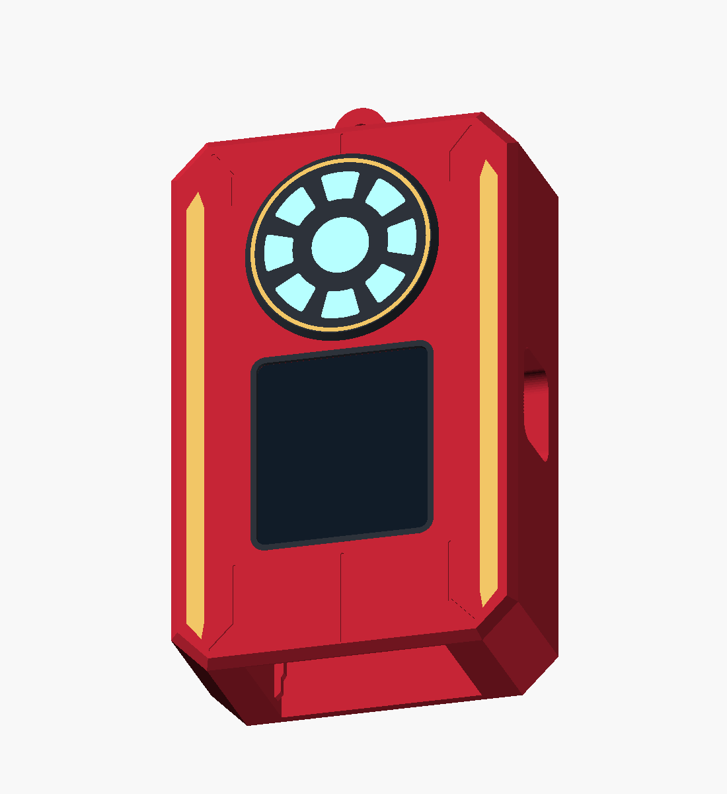
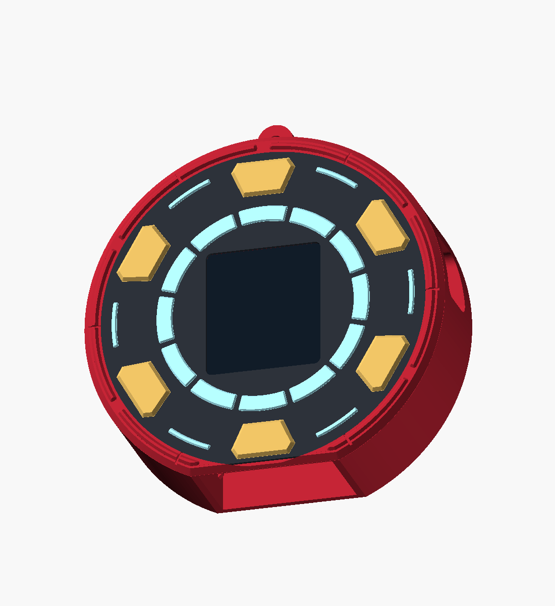

# Selected Iron Man concepts — printable outers

Implements image concepts **02, 03 and 05** using the existing ornament core. Earlier
designs, archives and the [concept images](docs/concepts/ironman_set_01/README.md) are preserved.

| 02 — Trapezoid Armor | 03 — Stark Core | 05 — Reactor Medallion |
|---|---|---|
|  |  |  |
| [Front view](docs/trapezoid_armor_front.png) | [Front view](docs/stark_core_front.png) | [Front view](docs/reactor_medallion_front.png) |
| [Four STLs](stl/trapezoid_armor/) | [Four STLs](stl/stark_core/) | [Four STLs](stl/reactor_medallion/) |
| [OpenSCAD source](ironman_trapezoid_armor.scad) | [OpenSCAD source](ironman_stark_core.scad) | [OpenSCAD source](ironman_reactor_medallion.scad) |
| 92 × 25.8 × 92 mm | 58 × 26 × 99 mm | 90 × 25.8 × 93 mm |

Dimensions are width × depth × height in print orientation and include the hanging loop.

**Trapezoid Armor** has beveled red chest/arm plates, raised gold shoulder and bicep panels,
and a gold-and-blue trapezoid frame around the rectangular display. **Stark Core** has a
beveled rectangular case, thin gold side rails and a separate reactor above the display:
eight blue segments and a blue center inside a gold-rimmed charcoal housing. **Reactor
Medallion** has twelve blue ring segments, six outer blue accents and six raised gold blocks
around the display. Its small flat bottom provides the core entry and print-bed contact.

The surface bevels and raised details are modeled geometry. The blue areas are coloured
inlays; the image concepts' emitted glow and reflective finish do not imply added lighting
hardware. The black display shown in previews is a visual proxy, absent from all STLs.

## Printing and assembly

For **one design at a time**, load all four of its STLs into Bambu Studio as **one object
with multiple parts**. Keep their shared coordinates; do not place the individual inlays
on the bed separately. Assign red PLA to `body`, gold/yellow PLA to `gold`, charcoal/black
PLA to `black`, and pale cyan/light-blue PLA to `cyan`. Each design uses four filaments.

The exports stand on their open bottom. Use a brim, a 0.4 mm nozzle and 0.16–0.20 mm layers,
as with the existing sleeves. Inspect the bridge paths and thin detail in the slicer before
printing. The existing core pocket retains its approximately 21 mm bridge at the closed end.
The 0.8 mm front inlay seats retain at least 1.0 mm of body backing; Stark Core's raised
reactor lenses and rim have their own charcoal backing. No changes to the electronics or
the core tray/bezel are required. The rails, detents, display and USB/DC openings reuse the
shared dimensions in [xmas_orn_case.scad](xmas_orn_case.scad).

The medallion has the narrowest base footprint, so its brim is particularly important.
Physical fit and slicing have not been tested. Existing core measurement assumptions in
the [enclosure instructions](README.md) still apply.

## Rebuilding and validation

```sh
./export_selected_ironman.sh       # all 12 STLs and six preview images
./export_stark_core.sh            # Stark Core alone
```

Set `OPENSCAD` to the executable path if it is not on PATH or in `/Applications`.
Concepts 02 and 05 share [ironman_selected_parts.scad](ironman_selected_parts.scad); Stark
Core has its own source because its reactor uses a separate raised housing. Each source
supports its assembled name (`trapezoid_armor`, `stark_core`, `reactor_medallion`), individual
colour selections such as `gold_print`, and `check_core`, `check_colours`, `check_backing`,
`check_window`. Set `preview_display = false` to view the open display cutout.

The [validation report](docs/selected_ironman_validation.json) records the source and STL
hashes, dimensions and geometry results. All twelve meshes are watertight with consistent
winding; all three bodies are connected solids. Core, window and backing checks are empty.
Colour intersections are below a 0.0001 mm³ tolerance for numerical boundary fragments.

To repeat after rebuilding:

```sh
python3 -m venv /tmp/selected-ironman-validation
/tmp/selected-ironman-validation/bin/pip install numpy trimesh networkx
/tmp/selected-ironman-validation/bin/python validate_selected_ironman.py
```
