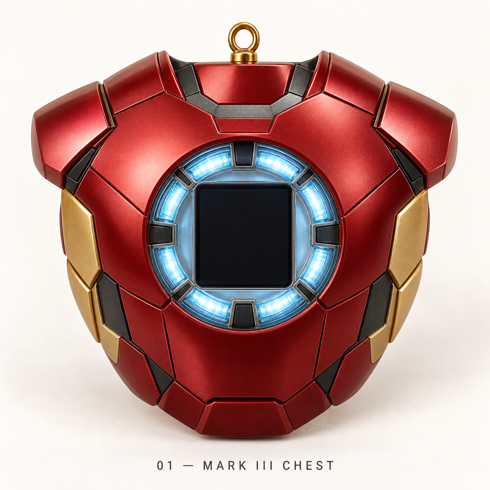
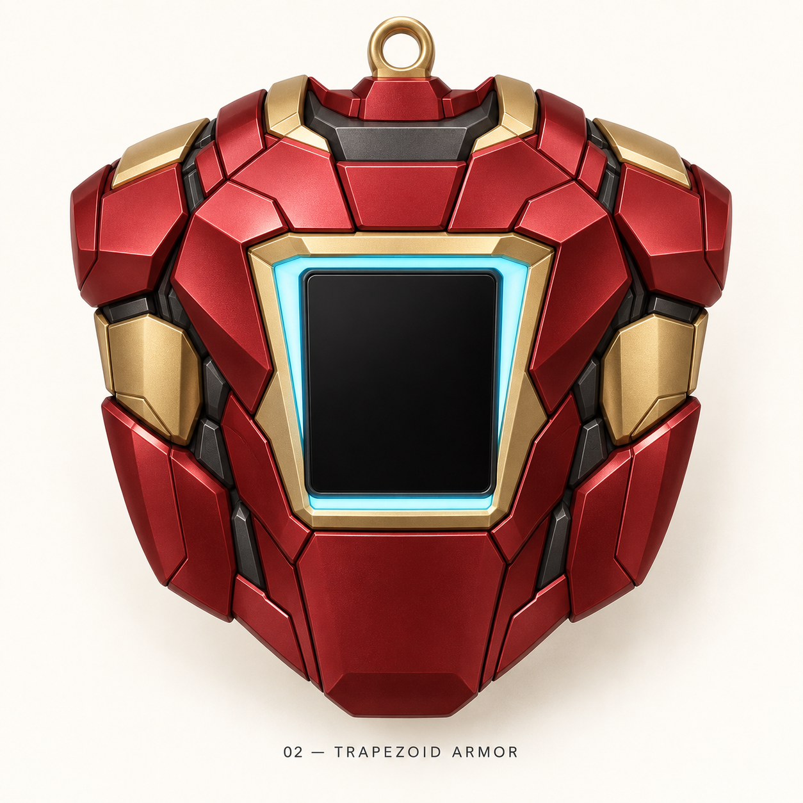
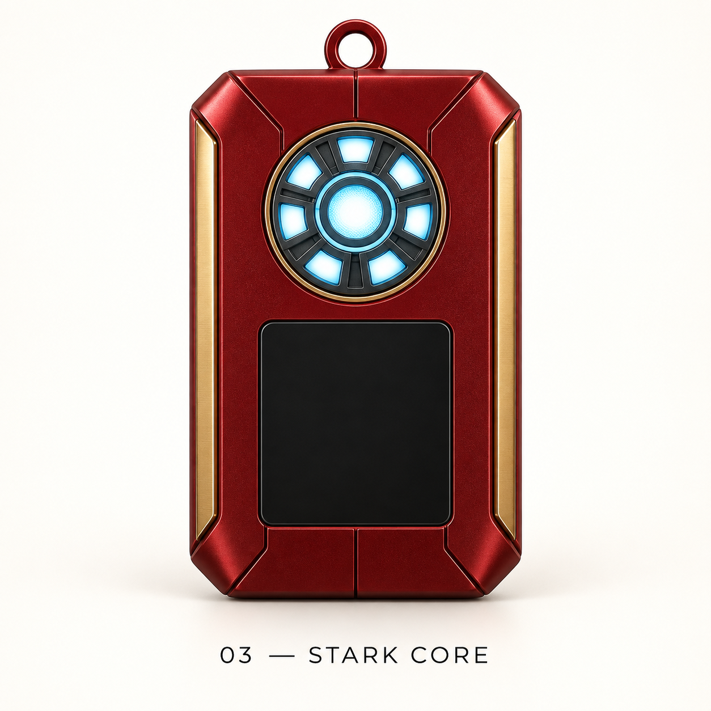
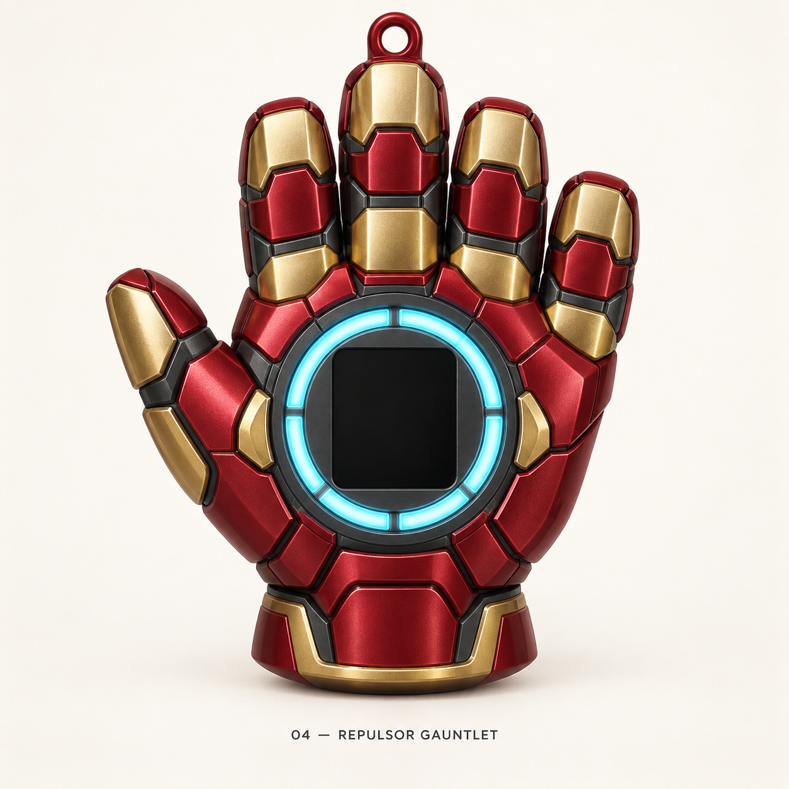
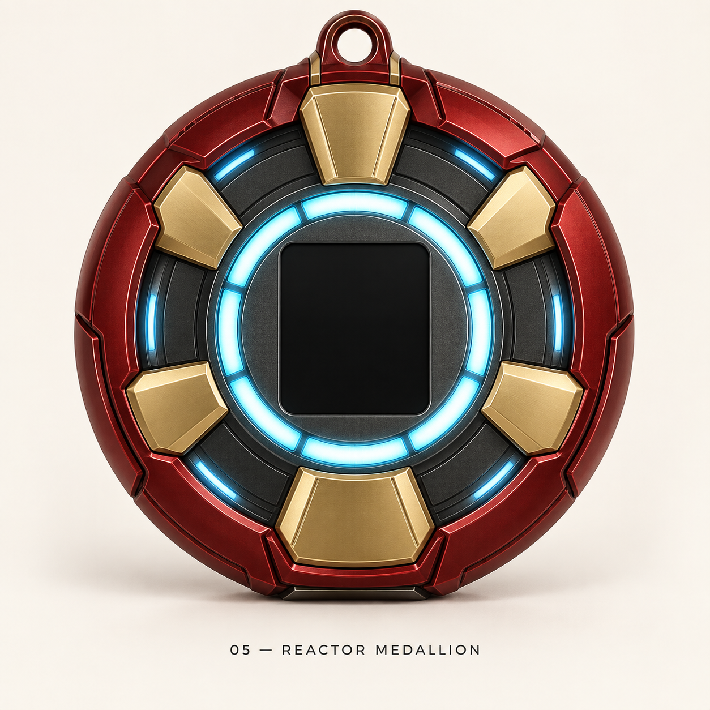

# Iron Man image concepts — set 01

Five image-only design explorations generated with the built-in ImageGen tool. No CAD, STL,
core dimensions, or firmware files were changed during this exploration. The black rectangle
represents the display. These are visual concepts; details, glow and finish are illustrative,
and manufacturing fit has not been validated.

| Concept | Image |
|---|---|
| 01 — MARK III CHEST | [Open image](01_mark_iii_chest.png) |
| 02 — TRAPEZOID ARMOR | [Open image](02_trapezoid_armor.png) |
| 03 — STARK CORE | [Open image](03_stark_core.png) |
| 04 — REPULSOR GAUNTLET | [Open image](04_repulsor_gauntlet.png) |
| 05 — REACTOR MEDALLION | [Open image](05_reactor_medallion.png) |

[Final prompts and saved-image paths](final_set.json). [Initial prompts](prompts.json).
The helmet-badge image request failed twice; concept 03 was replaced by Stark Core.

## 01 — MARK III CHEST

## 02 — TRAPEZOID ARMOR

## 03 — STARK CORE

## 04 — REPULSOR GAUNTLET

## 05 — REACTOR MEDALLION

