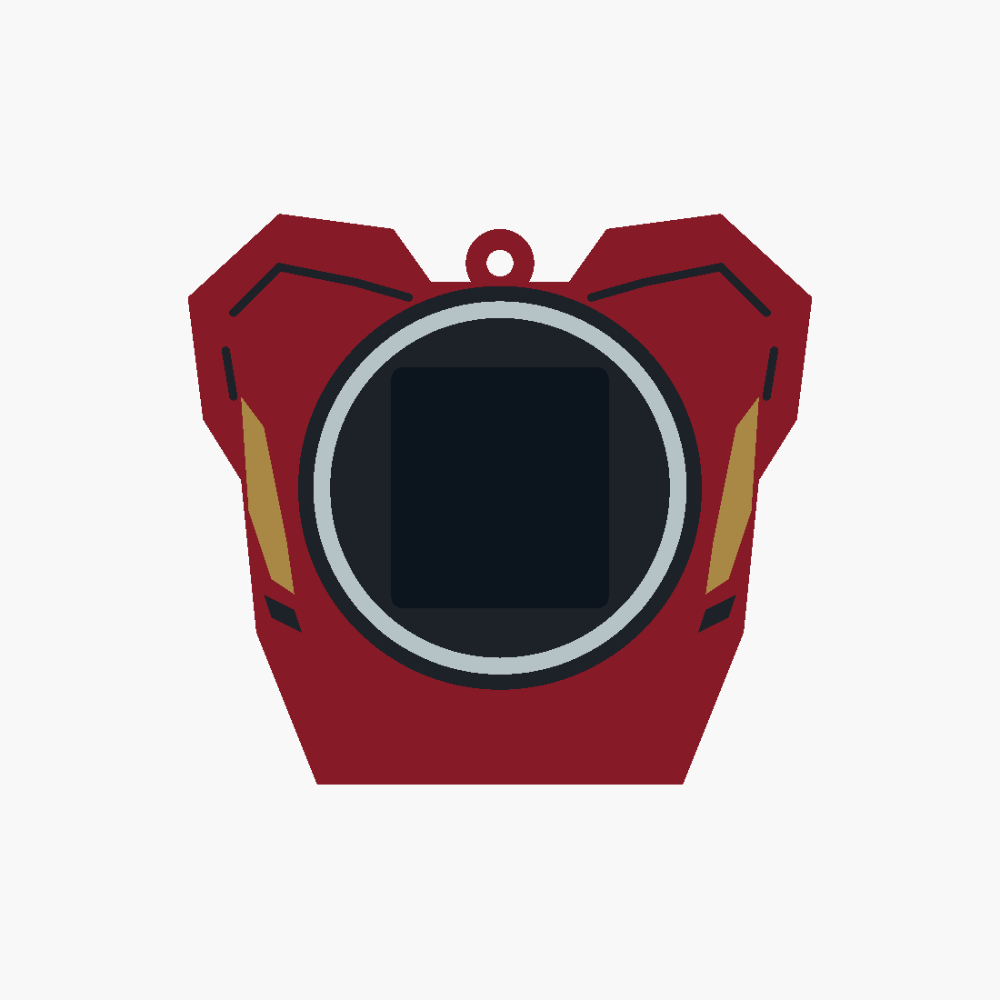

# Iron Man v10 — return to the v5 front

Restores v5's compact, tapered chest silhouette and large circular reactor frame around
the display. The raised neck and lower central lines are removed. Small gold upper-arm
plates and dark elbow joints follow the existing sides. Earlier versions are preserved.

- [Editable source](ironman_v10.scad)
- [Four printable STLs](stl/ironman_v10/)
- [Angled preview](docs/ironman_v10_iso.png)
- [Validation results](docs/ironman_v10_validation.json)

Overall size: **82 × 25 × 75 mm**. The existing core, rails, detents, display opening and
cable access are reused. The dark screen proxy is excluded from the printable parts.

Load all four STLs together as **one object with multiple parts** in Bambu Studio. Assign
red PLA to `body`, gold/yellow to `gold`, black to `black`, and white to `white`. Keep the
shared coordinates and print on the open bottom with a brim, using the existing sleeve
settings. The 0.8 mm inlays have 1.0 mm of body backing.

Run `./export_ironman_v10.sh` to rebuild. The source defaults to `reactor_shape = "circle"`;
`"trapezoid"` is available for an alternative preview or rebuild. The checked-in STLs and
validation report describe the circular version. Selections include `ironman_v10`, individual
parts such as `gold_print`, and `check_core`, `check_colours`, `check_backing`.

All four exported meshes are watertight, the body is connected, and core clearance and
inlay backing pass. Colour intersections are below 0.0001 mm³. Physical fit and slicing
remain untested.
