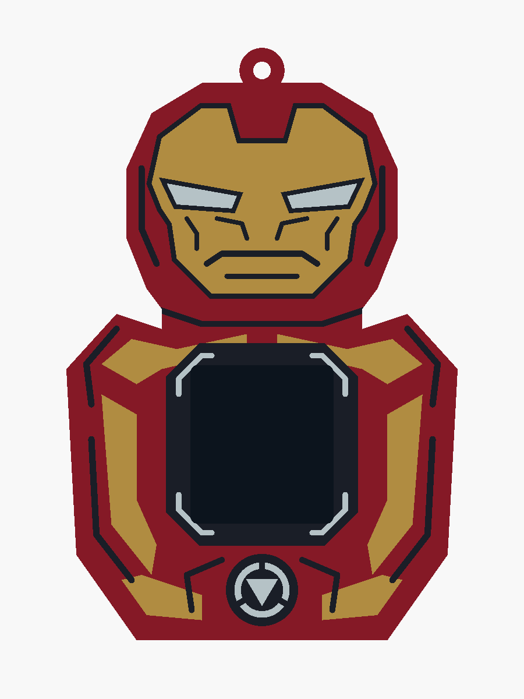

# Iron Man — revision 3

A complete helmet above an armoured chest, with angular eyes, cheek plates, shoulder
armour and an arc-reactor detail. The screen sits in the chest, leaving the face intact.
Versions 1 and 2 and the other four superhero outers are preserved.

- [Editable OpenSCAD source](ironman_v3.scad)
- [Four printable STLs](stl/ironman_v3/)
- [Angled preview](docs/ironman_v3_iso.png)
- [Mesh and clearance results](docs/ironman_v3_validation.json)

The assembled print is **78 × 25 × 118 mm**, including its hanging loop. It reuses the
existing core pocket, rails, detents, display opening, cable tunnels and finger recesses.
The additional height gives the helmet enough room above the display.

Load all four STLs together in Bambu Studio as **one object with multiple parts**. Assign
red PLA to `body`, gold/yellow PLA to `gold`, black PLA to `black`, and white PLA to `white`.
Keep the shared coordinates; individual inlays should not be dropped onto the bed.
The exports stand on the open bottom. Use a brim and the existing sleeve print settings.
The 0.8 mm flush inlays retain 1.0 mm of body material behind them.

Run `./export_ironman_v3.sh` to regenerate this revision's STLs and previews. In OpenSCAD,
`part = "ironman_v3"` shows the assembled colours; `part = "gold_print"` selects a single
print-oriented colour. The dark display proxy is shown only in the assembled preview and
is absent from the exported parts; set `preview_display = false` to hide it.

All four exported meshes are watertight with consistent winding; the body is one connected
solid. The seated-core and inlay-backing checks are empty. Colour intersections are below
the 0.0001 mm³ numerical tolerance. The source includes `check_core`, `check_colours`, and
`check_backing` selections for repeating these CAD checks. Physical fit and slicing remain
untested; the [core measurement assumptions](README.md) still apply.
