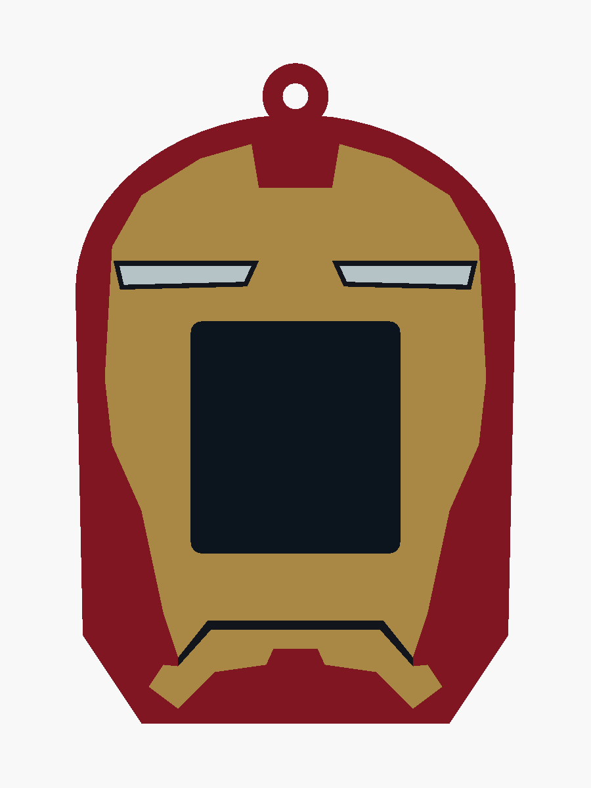

# Iron Man v4 — simplified 2008 helmet

A compact Mark III-inspired helmet with a broad gold faceplate, narrow horizontal eyes,
red forehead notch and one jaw-plate seam. The silhouette replaces v3's bust and ornamental
detail. Earlier revisions and the other four superheroes remain untouched.

- [OpenSCAD source](ironman_v4.scad)
- [Four printable colour parts](stl/ironman_v4/)
- [Angled preview](docs/ironman_v4_iso.png)
- [Validation report](docs/ironman_v4_validation.json)

Size including hanging loop: **60 × 25 × 90 mm**. The existing core, slide rails, detents,
display opening and cable clearances are reused. The dark rectangle represents the screen
and is absent from the printable parts.

Load all four STLs together as **one object with multiple parts** in Bambu Studio. Assign
red PLA to `body`, gold/yellow to `gold`, black to `black`, and white to `white`. Keep their
shared coordinates and print standing on the open bottom with a brim, using the existing
sleeve settings. The flush inlays are 0.8 mm deep with 1.0 mm of body backing.

Rebuild with `./export_ironman_v4.sh`. OpenSCAD selections include `ironman_v4` for the
assembly, `gold_print` for a colour part, and `check_core`, `check_colours`, `check_backing`
for geometric checks. All four STLs are watertight, the body is connected, core and backing
checks are empty, and colour intersections are below 0.0001 mm³. Physical fit and slicing
have not been tested.

Visual reference: [Mark III prototype helmet, Van Eaton Galleries](https://bid.vegalleries.com/An-Iron-Man-Mark-III-Helmet-Sample-Product-Prototype_i47769734).
The design adapts its broad plate shapes and slim lenses around the required display opening.
