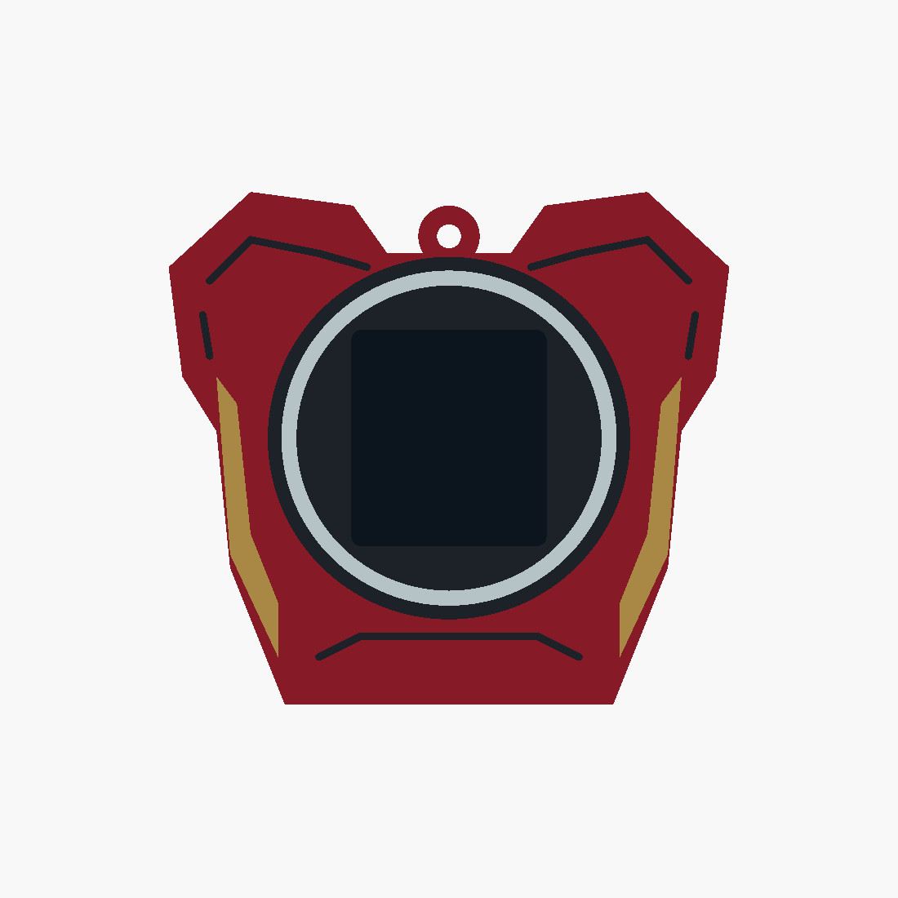

# Iron Man v5 — chest plate

A simple red chest plate with broad shoulders, small gold flank panels and a white circular
arc-reactor ring around the display. Earlier revisions and the other superhero designs are
preserved.

- [Editable source](ironman_v5.scad)
- [Four printable STLs](stl/ironman_v5/)
- [Angled preview](docs/ironman_v5_iso.png)
- [Validation results](docs/ironman_v5_validation.json)

Overall size: **82 × 25 × 75 mm**. The hanging loop sits in the collar recess. The existing
core pocket, rails, detents, display opening and cable access are reused. The rectangular
screen remains unobstructed inside the circular reactor bezel; the dark preview screen is
excluded from exported parts.

Load all four STLs together as **one object with multiple parts** in Bambu Studio. Assign
red PLA to `body`, gold/yellow to `gold`, black to `black`, and white to `white`. Keep the
shared coordinates and print on the open bottom with a brim, using the existing sleeve
settings. Inlays are 0.8 mm deep with 1.0 mm of body material behind them.

Run `./export_ironman_v5.sh` to rebuild the STLs and previews. OpenSCAD selections include
`ironman_v5`, individual parts such as `gold_print`, and `check_core`, `check_colours`,
`check_backing`. All four meshes are watertight, the body is connected, core and backing
checks are empty, and colour intersections are below 0.0001 mm³. Physical fit and slicing
remain untested.
