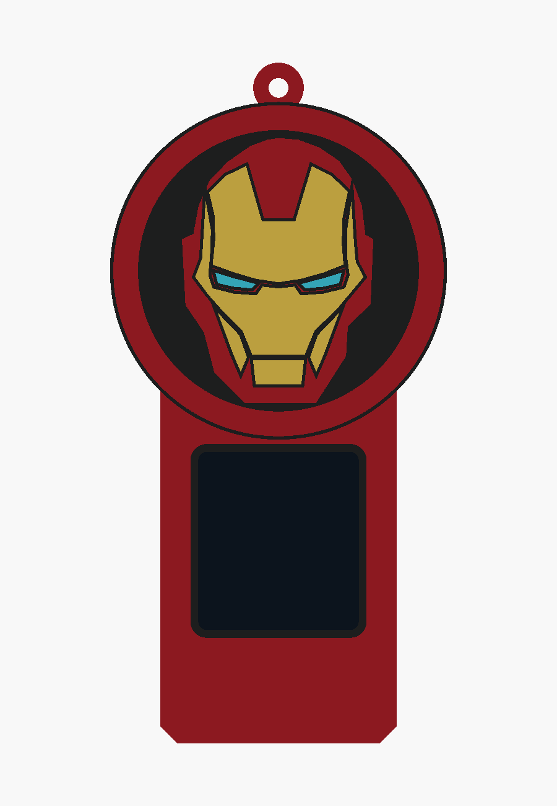

# Iron Man v6 — reference badge above the display

The supplied image is adapted into a flat red-ring badge with a black field, red helmet
shell, gold plates and cyan eyes. The complete emblem sits above the display, as requested.
The screen occupies a plain red lower section. All earlier revisions remain preserved.

- [Enclosure source](ironman_v6.scad)
- [Editable helmet artwork](ironman_reference_art.scad)
- [Four printable STLs](stl/ironman_v6/)
- [Angled preview](docs/ironman_v6_iso.png)
- [Validation results](docs/ironman_v6_validation.json)

Overall size: **60 × 25 × 121 mm**, including the hanging loop. The circular badge is 60 mm
across. The existing core pocket, rails, detents, cable access and display opening are reused.
The dark screen proxy appears only in previews and is excluded from printable parts.

Load all STLs together as **one object with multiple parts** in Bambu Studio. Assign red PLA
to `body`, black to `black`, gold/yellow to `gold`, and cyan/light blue to `cyan`. White can
substitute for cyan. Keep the shared coordinates and print on the open bottom with a brim,
using the existing sleeve settings. Inlays are 0.8 mm deep with 1.0 mm of body backing.

Run `./export_ironman_v6.sh` to regenerate STLs and previews. OpenSCAD selections include
`ironman_v6`, individual parts such as `gold_print`, and `check_core`, `check_colours`,
`check_backing`. All four meshes are watertight, the body is one connected solid, core and
backing checks are empty, and colour intersections are below 0.0001 mm³. Physical fit and
slicing remain untested.
