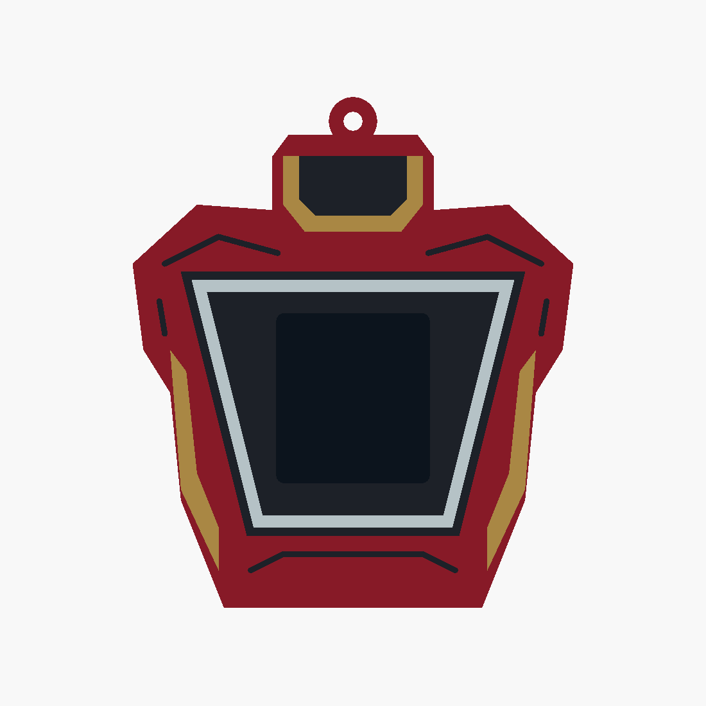

# Iron Man v7 — trapezoid reactor chest

Returns to the v5 chest, replacing its circular reactor ring with a wide-top trapezoid
frame and extending the neck above the shoulders. A gold collar surrounds the dark throat
panel. The other details stay restrained: red armour, gold flanks and simple plate seams.
All earlier designs are preserved.

- [Editable source](ironman_v7.scad)
- [Four printable STLs](stl/ironman_v7/)
- [Angled preview](docs/ironman_v7_iso.png)
- [Validation results](docs/ironman_v7_validation.json)

Overall size including hanging loop: **82 × 25 × 95 mm**. The existing core pocket, rails,
detents, display opening and cable access are reused. The rectangular screen remains fully
unobstructed within the trapezoid frame. Its dark preview proxy is excluded from exports.

Load all four STLs together as **one object with multiple parts** in Bambu Studio. Assign
red PLA to `body`, gold/yellow to `gold`, black to `black`, and white to `white`. Keep their
shared coordinates and print on the open bottom with a brim, using the existing sleeve
settings. Inlays are 0.8 mm deep with 1.0 mm of body backing.

Run `./export_ironman_v7.sh` to regenerate STLs and previews. OpenSCAD selections include
`ironman_v7`, individual parts such as `gold_print`, and `check_core`, `check_colours`,
`check_backing`. All four meshes are watertight, the body is connected, core and backing
checks are empty, and colour intersections are below 0.0001 mm³. Physical fit and slicing
remain untested.
