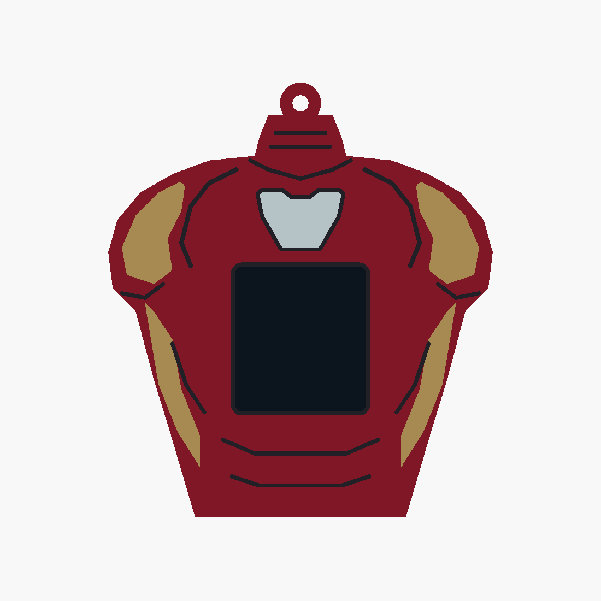

# Iron Man v8 — reference torso

This revision follows the supplied torso reference with a narrow red plated neck, curved
shoulders with gold caps, a tapered waist, and a small complete reactor high on the chest.
The display sits below the reactor. The neck has two thin armor seams and a shallow collar
seam, replacing v7's large dark throat panel. All previous revisions remain preserved.

- [Editable source](ironman_v8.scad)
- [Four printable STLs](stl/ironman_v8/)
- [Angled preview](docs/ironman_v8_iso.png)
- [Validation results](docs/ironman_v8_validation.json)

Overall size including hanging loop: **84 × 25 × 95 mm**. The existing core pocket, rails,
detents, display opening and cable access are reused. The dark screen proxy is excluded
from the printable parts.

Load all four STLs together as **one object with multiple parts** in Bambu Studio. Assign
red PLA to `body`, gold/yellow to `gold`, black to `black`, and white to `white`. Keep their
shared coordinates and print on the open bottom with a brim, using the existing sleeve
settings. Inlays are 0.8 mm deep with 1.0 mm of body backing.

Run `./export_ironman_v8.sh` to regenerate STLs and previews. OpenSCAD selections include
`ironman_v8`, individual parts such as `gold_print`, and `check_core`, `check_colours`,
`check_backing`. All four meshes are watertight, the body is connected, core and backing
checks are empty, and colour intersections are below 0.0001 mm³. Physical fit and slicing
remain untested.
