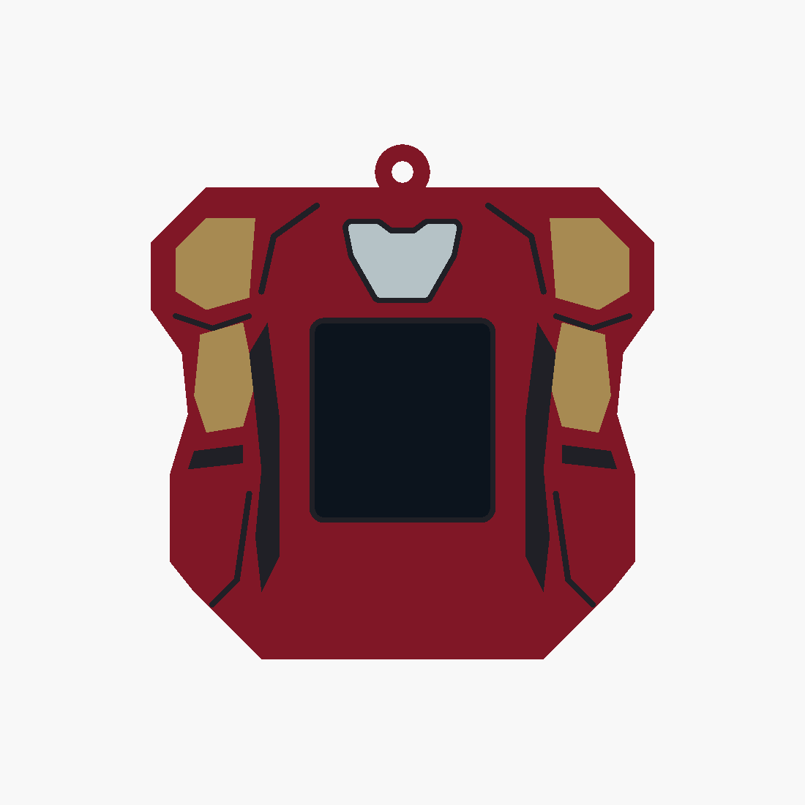

# Iron Man v9 — angular shoulders and arms

Revises v8 with faceted shoulder caps, a flat top without the raised neck, and a plain
central panel below the display. Gold upper arms, dark elbow joints and red forearms flank
the opening. The small complete reactor stays above the display. All previous versions
are preserved.

- [Editable source](ironman_v9.scad)
- [Four printable STLs](stl/ironman_v9/)
- [Angled preview](docs/ironman_v9_iso.png)
- [Validation results](docs/ironman_v9_validation.json)

Overall size including hanging loop: **82 × 25 × 84 mm**. The existing core pocket, rails,
detents, display opening and cable access are reused. Dark seams separate the arms visually
while the underlying body remains connected. The lower outline slopes continuously from
the flat bottom so the forearm ends do not start as unsupported islands above the bed.
The dark preview screen is excluded from printable parts.

Load all four STLs together as **one object with multiple parts** in Bambu Studio. Assign
red PLA to `body`, gold/yellow to `gold`, black to `black`, and white to `white`. Keep their
shared coordinates and print on the open bottom with a brim, using the existing sleeve
settings. Inlays are 0.8 mm deep with 1.0 mm of body backing.

Run `./export_ironman_v9.sh` to regenerate STLs and previews. OpenSCAD selections include
`ironman_v9`, individual parts such as `gold_print`, and `check_core`, `check_colours`,
`check_backing`. All four meshes are watertight, the body is connected, core and backing
checks are empty, and colour intersections are below 0.0001 mm³. Physical fit and slicing
remain untested.
